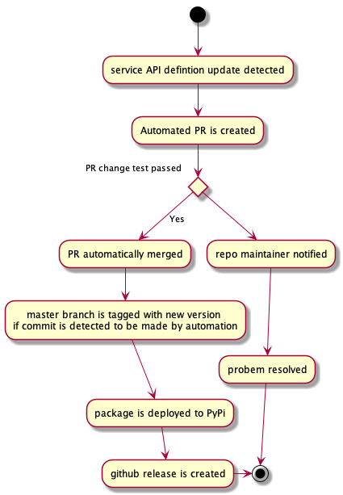

## Automatic microservices API releases

Alert Logic microservices code is maintained privately, OpenAPI definitions source code 
is kept along with the code of the microservices. 
Automated process is keeping current repository up-to-date:

Definitions release pipeline is broken onto stages:
- (Stage 0)Automation creates a pull request with definitions change
- (Stage 1)Merge pull request produced by automation
- (Stage 2)Automatically release definitions update(calculate new version and tag changes)
- (Stage 3)Create release containing just definitions
- (Stage 4)Deploy to PyPI

Please note, that automation only changes X.Y.<micro> version, major and minor would be changed manually. 